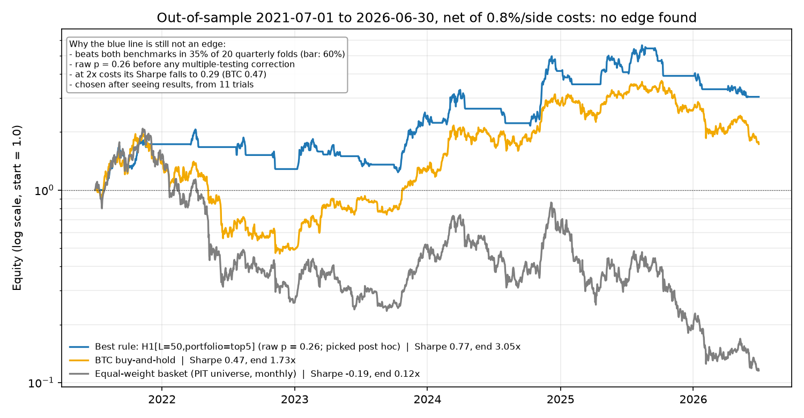
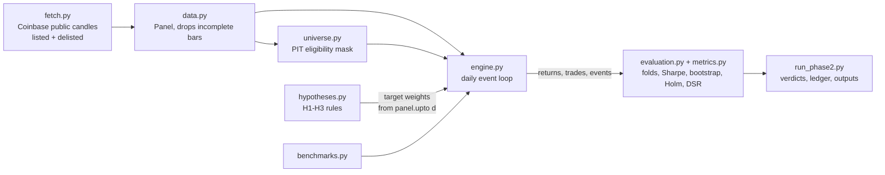

# crypto-edge

**Question:** can a retail, long-only, spot-only crypto strategy beat buy-and-hold BTC and an equal-weight altcoin basket on a 1–4 week horizon after realistic Coinbase costs?

**Method:**
- **Honest data.** A point-in-time, survivorship-safe universe of Coinbase USD pairs, *including 77 delisted coins*, filtered by 30-day volume ≥ $5M. It is built from the free public API.
- **Rules fixed in advance.** Three trend-following rules were committed (`c24ad22`) before any backtest ran. They were tested walk-forward (12-month train, 3-month test, 20 folds) at 0.8% per side, with a stress case at 2× cost.
- **A strict, pre-set bar.** A rule has to beat both benchmarks in ≥ 60% of folds, have drawdown ≤ BTC's, survive doubled costs, and pass a Holm-corrected bootstrap test at p < 0.05 across all 11 trials.

**Verdict: no edge found, best raw p = 0.26.** Per the spec's kill criterion, the trading system was not built.



*The blue line is the best of 11 trials, picked after the fact. It still beats both benchmarks in only 35% of folds and drops to Sharpe 0.29 at 2× costs. Regenerate with `uv run --group charts python research/03_equity_chart.py` (reads committed results only).*

Licensed under the [MIT License](LICENSE).

## Problem
- **Venue and account:** Coinbase Advanced, spot only, long-only, Maryland (US) account.
- **Limits:** ≤ 5 positions, ≤ 20% per asset, ≥ 10% cash, 15% max drawdown, 5% daily-loss halt.
- **Costs:** 0.6% fee + 0.2% slippage per side, stress-tested at 2×.
- **Benchmarks:** BTC buy-and-hold, and an equal-weight basket of the point-in-time universe.
- **Full specification:** SPEC.md.

## Approach
1. **Point-in-time, survivorship-safe universe.** Coinbase USD pairs, *including 77 delisted products*, filtered by 30-day ADV ≥ $5M and requiring a bar on the decision date. It is built from the free public API (`src/edge/fetch.py`, `src/edge/universe.py`).
2. **Parallel research.** Four tracks: regime, two candidate-asset screens, and a literature review (`research/notes/`). All sources are dated; estimates are labeled.
3. **Pre-registration.** Hypotheses, parameter grids, edge bar and multiple-testing family were committed (`c24ad22`) before any strategy touched real prices.
4. **Test-driven harness** (`src/edge/`, 51 tests):
   - Event-driven engine: next-open fills, costs on both sides, delisting write-offs, no-trade band. SPEC limits are enforced on every order whatever the strategy asks for.
   - Walk-forward folds: 12-month train, 3-month test, 20 folds.
   - Stationary-bootstrap p-values, Holm correction, Deflated Sharpe.
   - Append-only trial ledger (`research/trials.csv`).
   - Look-ahead guard: perturbing future data must leave every past decision unchanged. The unit test and an end-to-end check both enforce this.
5. **Independent code review.** It found 5 minor issues, all fixed test-first and re-run. Verdicts were unchanged, and the sensitivity of the numbers to the fixes is disclosed.

## Results (out-of-sample 2021-07-01 → 2026-06-30, net of costs)
| | Sharpe | Max DD | Folds beating both benchmarks (need ≥ 60%) | Holm p | Verdict |
|---|---|---|---|---|---|
| BTC buy-and-hold | 0.47 | 77% | — | — | benchmark |
| Equal-weight PIT universe | −0.19 | 95% | — | — | benchmark |
| H1 BTC trend gate | −0.15 | 51% | 25% | 1.0 | no edge |
| H2 per-asset trend | −0.34 | 72% | 30% | 1.0 | no edge |
| H3 trend composite | −0.48 | 75% | 20% | 1.0 | no edge |

- None of the signals beats BTC even at zero cost.
- The smallest raw p-value across all 11 trials is 0.26.
- Details, diagnostics and the risk list are in EDGE_REPORT.md.

## Reproduce
```bash
uv sync
make ci                                     # look-ahead gate, then all 51 tests (same as GitHub Actions)
uv run python -m edge.fetch                 # Coinbase daily candles -> ~/.cache/crypto-edge (~15 min first time)
uv run python -m edge.run_phase2            # every pre-registered trial, ~1 min
uv run python research/02_phase2_diagnostics.py
```
- The run is pinned to `AS_OF = 2026-09-23`.
- `research/results/phase2/manifest.json` records the sha256 of every candle file used. A fresh fetch can differ if Coinbase revises candles; compare the hashes.
- Each run appends to `research/trials.csv`.

## Architecture

- **Causality boundary:** strategies only ever receive `panel.upto(d)`. Orders decided at the close of bar d fill at the open of bar d+1 (+ delay). The full panel is used only for accounting (marking, delisting write-offs).
- **Limits live in the engine** (`apply_limits` and execution-time checks). No strategy output can exceed 5 positions, 20% per asset, or 90% gross, or bypass the daily-loss or drawdown halts.
- **CI:** `.github/workflows/ci.yml` runs `make ci`: the look-ahead gate first, then the full suite. Both look-ahead tests were mutation-checked: injecting a one-bar leak into the engine view or the universe ADV makes the gate fail.

## Limitations
- One venue, one market era (2021–26), and 20 folds, so statistical power is low.
- Only price/volume rules could be tested honestly. Fundamental, unlock and valuation ideas need point-in-time data that is not available for free (EDGE_REPORT §1.4).
- SPEC constraints (a 20% cap per asset, and a strict fold-level benchmark bar) shape the outcome.
- Taxes are not modeled. They would only widen the gap against BTC buy-and-hold.

## Layout
- `Makefile`, `.github/workflows/ci.yml`: CI.
- `LICENSE`: MIT.
- `docs/equity_curve.png`: README chart, from `research/03_equity_chart.py`.
- `SPEC.md`: approved specification.
- `EDGE_REPORT.md`: research, pre-registration, results, verdicts.
- `PROGRESS.md`: status and next steps.
- `docs/plans/phase-2.md`: harness plan.
- `src/edge/`: data, universe, engine, folds, metrics, benchmarks, hypotheses, evaluation, runner.
- `tests/`
- `research/`: notes, probe/diagnostic scripts, results, ledger.
